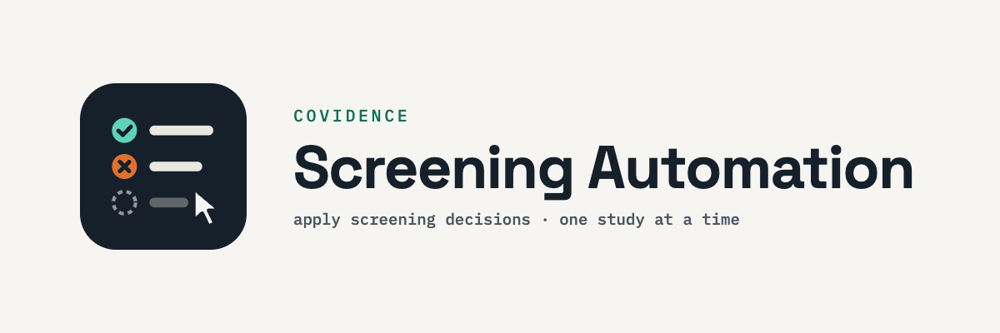

Applies pre-computed title/abstract screening decisions to a [Covidence](https://www.covidence.org/)
systematic-review project, one study at a time, via browser automation (Playwright).

**Context:** built for a systematic review on breastfeeding vs. formula feeding and the
infant gut microbiome (PROSPERO CRD420261485879, Covidence review 818465,
*"microbiome_methodologies"*). The decisions in `search-results-2026-10/screening_decisions.csv`
were produced by reading each record's full title and abstract against this review's own
PECO eligibility criteria — not by an LLM API call at vote-time, and not by guessing. This
repo captures the review step and the automation that applies it, including the bugs found
and fixed along the way, so the process is reproducible and the failure modes are documented.

---

## Contents

| File | Purpose |
|---|---|
| `apply_screening_decisions.py` | Main script. Logs into Covidence, reads the screening queue, and casts the correct vote (Include → Yes, Exclude → No, Maybe → Maybe) for each study, one at a time. |
| `debug_queue.py` | Read-only diagnostic. Logs in, opens the queue, and prints the raw text/HTML of the first few study cards — casts **no votes**. Use this if Covidence changes its page layout and the main script starts misbehaving again (see [Known issues](#known-issues--troubleshooting-history) below). |
| `search-results-2026-10/screening_decisions.csv` | The screening results: one row per PMID, with columns `pmid,decision,justification`. |
| `requirements.txt` | Python dependencies. |
| `.env.example` | Template for your local credentials file. |
| `.gitignore` | Keeps `.env`, virtual environments, and logs out of version control. |

---

## Background: how `screening_decisions.csv` was produced

- **Source set:** a PubMed search executed via NCBI E-utilities, exported as MEDLINE text,
  producing **2,109 deduplicated records**. This is the exact file that was imported into
  Covidence review 818465 — the two were diffed PMID-for-PMID and confirmed identical
  (2,109/2,109 match, zero on either side) before any voting was attempted.
- **Screening method:** each record's full title and abstract (not just the title) was read
  against the review's settled PECO criteria:
  - Healthy term infants (≥37 weeks gestation), 0–12 months at stool sampling — preterm/NICU
    populations excluded by design.
  - Exposure/comparison must be breastfeeding vs. formula (or vs. mixed/combination feeding)
    as an *actual analyzed group comparison* — not merely an adjustment covariate.
  - Outcome must be gut/stool **bacterial** composition assessed via sequencing (16S rRNA or
    shotgun metagenomics) — this is a hard gate. Function (metabolomic, PICRUSt-predicted,
    targeted assay, shotgun) is a secondary, non-gating outcome but does not substitute for
    the sequencing-based composition requirement. qPCR-only, FISH-only, culture-only, or
    DGGE/microarray-only methods fail this gate even when they report feeding-mode
    differences.
  - Non-stool specimens (breast milk, colostrum, oral, nasopharyngeal, skin, vaginal,
    blood/serum/urine), animal models, in vitro/ex vivo/organoid/bioreactor studies, bacterial
    strain/genomic/enzyme characterization studies with no infant cohort, virome/mycobiome-only
    outcomes, disease-population studies where the primary comparison is by disease rather than
    feeding mode, narrative reviews/commentaries/conference-abstract-only records, and
    protocols with no results yet reported were excluded.
- **Decision values:**
  - `Include` — meets all criteria.
  - `Exclude` — fails one or more criteria (reason given in `justification`).
  - `Maybe` — genuinely ambiguous (e.g., abstract doesn't state the sequencing method,
    unclear whether a real feeding-mode comparison is reported, missing abstract text).
    These are deliberately **not** force-resolved to Include/Exclude; they're meant to
    surface for full-text human review, which is exactly what voting "Maybe" in Covidence
    does.
- **Final tallies (2,109 total):** 163 `Include`, 1,922 `Exclude`, 24 `Maybe`.

---

## Prerequisites

- Python 3 (any recent 3.x)
- A Covidence account with voting permission on the target review
- macOS/Linux/Windows with a terminal — no other software needed; Playwright installs its
  own Chromium browser (see below)

---

## Setup

```bash
# 1. (recommended) create and activate a virtual environment
python3 -m venv .venv
source .venv/bin/activate

# 2. install Python dependencies
pip install -r requirements.txt

# 3. download the Chromium browser Playwright drives (one-time, ~100-200MB)
playwright install chromium

# 4. create your local credentials file
cp .env.example .env
```

Open `.env` in a text editor and fill in your **own** real Covidence login:

```
COVID_ID=you@example.com
COVID_PASSWORD=your_real_covidence_password
```

`.env` is loaded automatically via `python-dotenv` and is excluded from git by
`.gitignore` — never commit it, never share it.

---

## Usage

### 1. Test run first — always

Before trusting it with the full queue, sanity-check on a handful of studies:

```bash
python3 apply_screening_decisions.py --limit 10
```

A visible Chromium window opens, logs in, goes to the review's screening queue, and votes
on the first 10 studies at the top of the queue. Watch the terminal output — each line
should show a **real, 7–8 digit PMID** next to a sensible title and decision, e.g.:

```
2026-10-01 16:21:26,722 INFO PMID 27446009: Exclude ('Flow Cytometric and 16S Sequencing
Methodologies for Monitoring the Physiological Status of the Microbiome in Powdered Infant
Formula Production.')
```

Then **cross-check a few of those in the Covidence UI directly** to confirm the votes
landed on the right studies before proceeding.

### 2. Full run

```bash
python3 apply_screening_decisions.py
```

With no `--limit`, it processes up to 10,000 studies (effectively "all of them"),
reloading the page before every single vote. This is deliberately slow and one-at-a-time
— see [How it works](#how-it-works) for why. For ~2,109 decisions expect this to take
several hours; let it run.

To run without a visible browser window:

```bash
python3 apply_screening_decisions.py --headless
```

---

## How it works

`apply_screening_decisions.py` loads all rows of the decisions CSV into memory, then loops:

1. Reload the screening queue URL (`.../review_studies/screen?filter=vote_required_from`).
2. Grab the study card currently at the top of the queue.
3. Extract its PMID and title from the page.
4. Look up the PMID in the loaded decisions.
   - **Found:** click the matching vote button (Yes/No/Maybe) and log it.
   - **Not found:** stop immediately without voting (see
     [`no_decision` behavior](#3-no_decision-now-stops-instead-of-guessing) below).
5. Repeat from step 1.

**Why reload before every single vote, one at a time?** Covidence's screening list recycles
DOM nodes between items. Voting on several queued studies without a fresh reload in between
produced unreliable results during testing — votes silently not saving, or landing on the
wrong study. A full page reload immediately before each individual interaction was the only
pattern that worked reliably.

---

## Known issues / troubleshooting history

This section exists because this exact script already failed once in a subtle way during
initial testing, and the fix depended on evidence gathered via `debug_queue.py` rather than
guessing. If Covidence changes its page markup in the future and voting starts behaving
oddly again, **repeat this process** rather than patching blindly:

1. Run `python3 debug_queue.py` (read-only, casts no votes) and inspect the printed card
   text/HTML.
2. Confirm by hand what the real PMID/title look like in the output.
3. Only then adjust the selectors/regex in `apply_screening_decisions.py`.

### 1. PMID extraction bug (found and fixed 2026-10-01)

**Symptom:** every vote in a 10-study test run logged as `PMID 10`, even though 10 different
papers with 10 different titles were clearly being voted on in sequence.

**Root cause:** the original extraction logic queried for a CSS class (`.ref-ids`) that
didn't contain the real reference number on the live page — it was silently matching some
unrelated element elsewhere in the DOM that happened to read "10". Because the function
returned a non-null value, it never triggered an error; it just silently fed the wrong key
into the decisions lookup, found no match, and voted the safe-default of "Maybe" on every
study — which, at the time, cast genuinely incorrect votes on real studies in the live
review.

**How it was actually found:** `debug_queue.py` was written to log in, print the full
visible text and outer HTML of the first few study cards, and cast no votes. The real PMID
turned out to be rendered as plain visible text on every card, e.g.:

```
DOI:
10.3389/fmicb.2016.00968
•
Ref ID: 27446009
```

**The fix:** `extract_ref_id()` now does a simple regex search (`Ref ID:\s*(\d+)`) against
the card's full visible text (`card.inner_text()`), instead of relying on a CSS class name
that may or may not exist on the current version of Covidence's page. This was verified
against two different real records (cross-checked the "Ref ID" number against the actual
PMID, title, and pre-computed decision for both) before being trusted.

**Cleanup required:** because 10 studies were mis-voted "Maybe" before this was caught, the
9 unique affected PMIDs had to be manually corrected back to their proper decision directly
in the Covidence UI. This is why the test-run-first step above exists — **always test on a
small `--limit` and spot-check in Covidence before running the full batch.**

### 2. Harmless double-vote on the first study right after login

**Symptom:** the very first study processed in a fresh run sometimes gets voted twice in a
row (same PMID, same correct decision, back-to-back).

**Likely cause:** a timing issue immediately after login/page-transition — the first
vote-click occasionally doesn't register before the page reloads, so the same top-of-queue
item is picked up again on the next loop iteration and voted again.

**Impact:** none. Both votes land on the identical, correct value — Covidence just keeps
the current vote. It costs a few wasted seconds at the start of a run and is not worth
engineering around.

### 3. `no_decision` now stops instead of guessing

Earlier behavior (now removed) was: if a study's PMID had no matching row in the decisions
CSV, vote "Maybe" as a "safe default" and keep going. **This is what let the extraction bug
above cause real damage** — it masked the underlying problem instead of surfacing it.

Current behavior: if a PMID has no pre-computed decision, the script **stops immediately
without voting**, logs a clear warning with the PMID and title, and must be resolved by a
human (decide if it's in scope, screen it and add it to the CSV, or vote it directly in
Covidence) before being restarted. This should not happen in normal operation — see
[Scope verification](#scope-verification) below — but if it does, don't restart blindly;
investigate the logged PMID first.

### Scope verification

Before the first full run, the PMID set in the raw PubMed MEDLINE export that was imported
into Covidence was diffed against the PMID set covered by `screening_decisions.csv` and
confirmed to be an **exact match** (2,109 in each, identical set, zero on either side). If
this script or CSV is ever reused against an updated or re-exported search, **redo this
check first** — don't assume the sets still match. A short Python snippet for this:

```python
import json, csv

# PMIDs from the raw MEDLINE (.txt) export, format: "PMID- 12345678"
raw_pmids = set()
with open("path/to/raw_export.txt") as f:
    for line in f:
        if line.startswith("PMID-"):
            raw_pmids.add(line.split("-", 1)[1].strip())

# PMIDs covered by the decisions file
decided_pmids = set()
with open("search-results-2026-10/screening_decisions.csv", newline="") as f:
    for row in csv.DictReader(f):
        decided_pmids.add(row["pmid"])

print("In raw export but not decided:", len(raw_pmids - decided_pmids))
print("Decided but not in raw export:", len(decided_pmids - raw_pmids))
print("Exact match:", raw_pmids == decided_pmids)
```

Any non-zero count on either line means something needs to be screened or reconciled
*before* running the script against that queue.

---

## Monitoring / resuming

- Every run appends to `covidence_apply.log` in this folder — check it for a final summary
  line (`Finished. Processed N studies this run.`) and for any `WARNING`/`ERROR` lines.
- The script always pulls whatever is currently at the top of Covidence's "vote required"
  queue. If you stop it (Ctrl+C) and rerun later, it just continues from wherever the queue
  is now — there's no separate resume flag or state file to manage.
- Keep an eye on it periodically rather than walking away entirely, in case Covidence shows
  a session timeout, CAPTCHA, or other interactive prompt the script can't handle on its own.

---

## After the run completes

1. Check `covidence_apply.log` for the final summary and scan for any `no_decision` or
   `extract_failed` entries.
2. Spot-check a handful of votes directly in the Covidence UI against
   `screening_decisions.csv` to confirm everything landed as expected.
3. For any `Maybe` votes, follow up with full-text review as normal — they were flagged as
   ambiguous on purpose, not resolved automatically.

---

## Security notes

- **Never commit `.env`.** It's excluded via `.gitignore`; only `.env.example` (with
  placeholder values) is tracked.
- `apply_screening_decisions.py` contains the Covidence review URL
  (`.../reviews/818465/...`). This is not a secret, but it is specific to this project's
  review — update `SCREENING_URL` if reusing this script for a different Covidence review.
- Virtual environment directories (`venv/`, `.venv/`, etc.) and the runtime log
  (`covidence_apply.log`) are also excluded from version control — they're local artifacts,
  not part of the reproducible process.

---

## CSV schema

`search-results-2026-10/screening_decisions.csv`:

| Column | Description |
|---|---|
| `pmid` | PubMed ID of the record |
| `decision` | One of `Include`, `Exclude`, `Maybe` |
| `justification` | One-sentence reason for the decision |

---

## Branding assets

`assets/` contains the project's icon set:

| File | Size | Used for |
|---|---|---|
| `readme-header.png` | 1200×400 | The header image at the top of this README. |
| `icon.png` | 512×512 | Square icon/favicon, for reuse wherever a small square mark is needed. |
| `social-preview.png` | 1280×640 | GitHub's link-unfurl / social-media preview image. |

GitHub doesn't let a repo set its own social preview image via a file in the repo or via
git push — it has to be uploaded through the web UI:

1. Go to the repo's **Settings → General**.
2. Scroll to **Social preview**.
3. Click **Edit**, upload `assets/social-preview.png`, and save.
